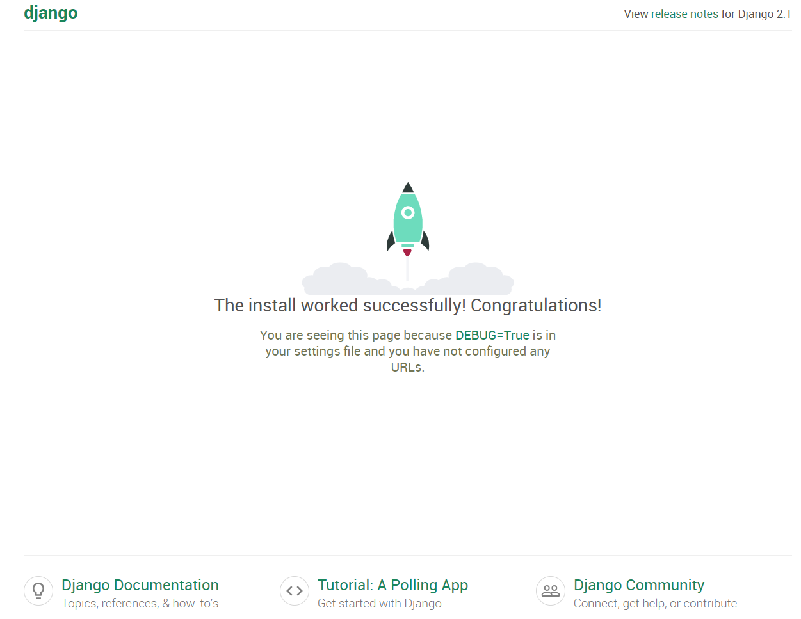

### 初始化django版本是2.1.7

测试：在项目根目录下，命令行运行 Python manage.py runserver，默认会以127.0.0.1:8000这个默认配置启动开发服务器。在浏览器中访问，出现以下界面，即可开始探索了。

- 由于私库限制为4人，所以此处建立的是公库。
- [git简单教程](https://zhuanlan.zhihu.com/p/30044692)
- [django教程](http://www.liujiangblog.com/course/django/2)
- 如果不想一个一个装包，可以考虑使用Anaconda，很好用。