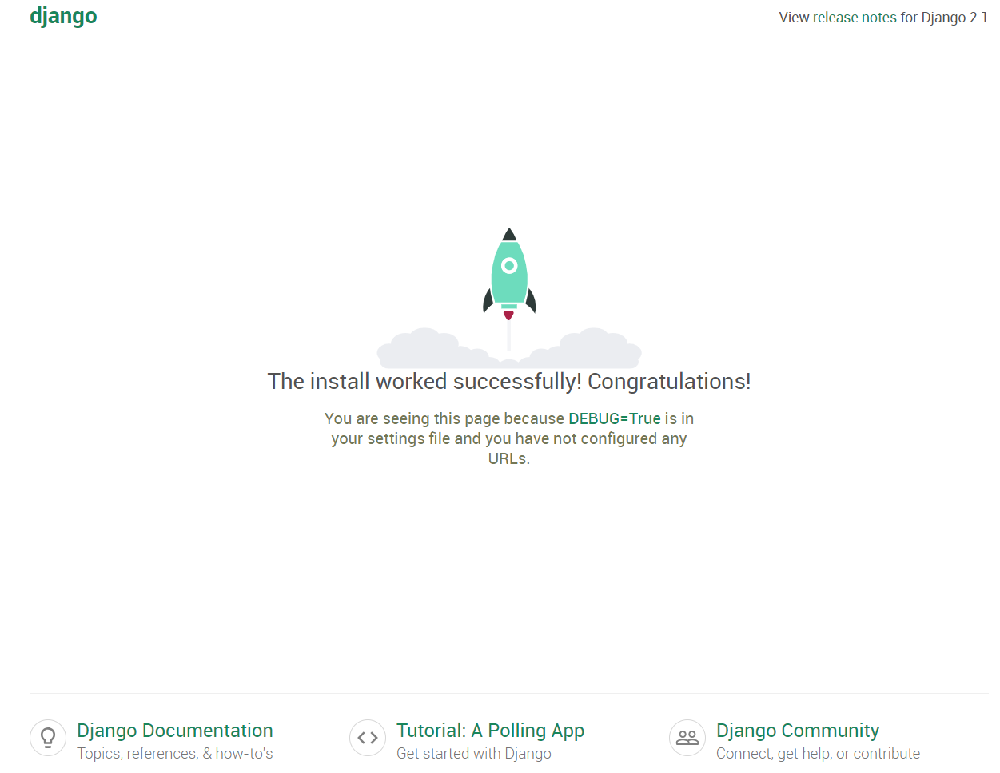
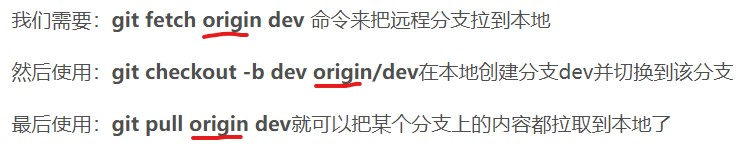

### 初始化django版本是2.1.7

测试：在项目根目录下，命令行运行 Python manage.py runserver，默认会以127.0.0.1:8000这个默认配置启动开发服务器。在浏览器中访问，出现以下界面，即可开始探索了。




- 由于私库限制为4人，所以此处建立的是公库。
- [git简单教程](https://zhuanlan.zhihu.com/p/30044692)
- [django教程](http://www.liujiangblog.com/course/django/2)
- 如果不想一个一个装包，可以考虑使用Anaconda，很好用。



- 将origin替换为https://github.com/AverJing/HousePriceAnalysis
- Weijia521
- xshell通过SSH连接azure，通过VM本地账户登录。

## 服务器问题

- 服务器，环境变量的配置：1.修改了~/.bashrc 2.修改了/etc/profile

- sudo chmod -R 777 anaconda3  提升conda命令权限，防止安装python包失败

- ```C++
  使用conda安装uwsgi，如果使用pip会出现gcc编译错误。
  https://github.com/unbit/uwsgi/issues/1516
  conda config --add channels conda-forge
  conda install uwsgi
  ```
- 连接出现averjing@wehome.chinanorth.cloudapp.chinacloudapi.cn: Permission denied (publickey).错误

  - 重置密码，重置SSH，重置设置。解决问题  
- uwsgi: error while loading shared libraries: libiconv.so.2: cannot open shared object file: No such file or directory

  -  conda install -c conda-forge libiconv

- 通过uwsgi访问uwsgi --http :8080 --module HousePriceAnalysis.wsgi等同于python manage.py runserver 0.0.0.0:8000
- cat /var/log/nginx/access.log  #网站日志
- cat /var/log/nginx/error.log  #系统日志
- uwsgi --socket housepriceanalysis.sock --module HousePriceAnalysis.wsgi --chmod-socket=666
- sudo /etc/init.d/nginx start    # 启动
sudo /etc/init.d/nginx stop     # 停止
sudo /etc/init.d/nginx restart  # 重启